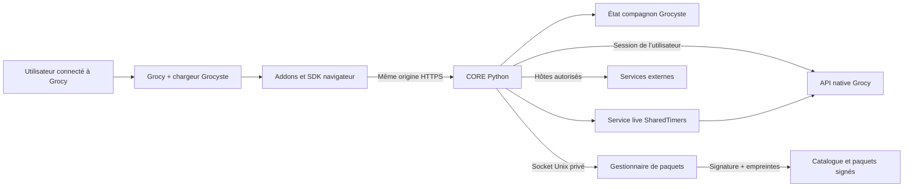

# Grocyste — Seasonings enabler

**Le CORE des assaisonnements pour Grocy.** Grocyste remplace NerdCore et fournit aux addons un point d’entrée commun : connexion avec le compte Grocy, accès à l’API, réglages persistants et gestion de paquets signés. Les fonctions restent réparties dans leurs propres dépôts ; ce dépôt contient le CORE, son SDK navigateur et les outils d’installation et de migration.

**Version du CORE : 1.0.0 · cible : Grocy 4.7.1 · licence : GPL-3.0-or-later.**

> La qualification de cette livraison est en cours. Les versions du catalogue ci-dessous viennent des manifestes ; elles ne constituent pas une attestation de migration réussie en production. Voir le [périmètre de compatibilité et de validation](docs/compatibilite.md).

## Ce que le CORE apporte

- **Un seul chargeur dans Grocy.** Le SDK charge les addons actifs après leurs dépendances et ouvre le panneau « Grocyste — Assaisonnements » depuis les réglages.
- **Les droits du compte connecté.** Les appels métier utilisent la session Grocy de l’utilisateur. L’administration des addons et des clés de fournisseurs exige les droits administrateur, vérifiés côté serveur.
- **Des paquets contrôlés avant activation.** Le gestionnaire vérifie signature Ed25519, empreintes SHA-256, versions et dépendances, puis remplace atomiquement le registre actif. Il propose installation, désactivation et retour à une version précédente disponible.
- **Un état compagnon.** Sessions, réglages, références de reçus, candidats Course U et suivi des opérations vivent dans l’état Grocyste, séparé de la base métier Grocy.
- **Une migration traçable.** Le chargeur historique reconnu est remplacé après sauvegarde et contrôle des empreintes. Les personnalisations étrangères au lot sont conservées ; les cas ambigus sont refusés.

L’installation et la migration n’ajoutent aucune recette, aucun produit, aucun stock, aucune course ni aucun repas. Le provisionnement technique nécessaire au service ou aux minuteurs passe par Grocy et reste distinct d’une importation métier. SafeImport n’applique une importation qu’à la suite d’une proposition explicitement revue.

## Installer

Depuis une copie vérifiée de la release sur l’hôte Linux de Grocy, pour l’installation Docker/Caddy reconnue :

```sh
sudo ./scripts/install.sh --origin https://grocy.example.org --caddyfile /opt/grocy/Caddyfile
```

Adaptez l’origine et le chemin Caddy. L’outil détecte le dossier de données du conteneur `grocy`, prépare ses sauvegardes, vérifie les paquets de la release et configure les services. Les prérequis, autres paramètres et procédures de reprise sont décrits dans le [guide d’installation](docs/installation.md). La publication des dépôts et des paquets doit précéder une installation publique depuis GitHub.

Après installation, connectez-vous à Grocy et ouvrez **Réglages → Grocyste — Assaisonnements**, ou la page `/stocksettings?grocyste=1` de votre instance. Avec un compte administrateur, utilisez **Relier cette instance Grocy** si le service n’est pas encore appairé. La gestion des paquets est réservée aux administrateurs ; les autres utilisateurs utilisent les addons autorisés avec leurs propres droits Grocy.

## Catalogue des neuf assaisonnements

Chaque ligne correspond à un dépôt indépendant. Les liens désignent les dépôts de destination du lot ; leur création et les releases signées doivent être confirmées par le rapport de publication.

| Assaisonnement | Version du manifeste | Usage | Dépendances d’addons |
| --- | --- | --- | --- |
| [RecipeScaling](https://github.com/Raph563/Grocyste-RecipeScaling) | `1.0.0` | Adapter les quantités et proportions d’une recette. | Aucune |
| [RecipeLive](https://github.com/Raph563/Grocyste-RecipeLive) | `1.0.0` | Suivre une recette, ses étapes et les variantes de méthode. | RecipeScaling, SharedTimers |
| [Budgets](https://github.com/Raph563/Grocyste-Budgets) | `1.0.0` | Calculer des budgets à partir des références de prix et unités disponibles. | RecipeScaling |
| [Equivalents](https://github.com/Raph563/Grocyste-Equivalents) | `1.0.0` | Proposer des équivalences et fourchettes pour la liste de courses. | Budgets |
| [SharedTimers](https://github.com/Raph563/Grocyste-SharedTimers) | `1.0.0` | Partager minuteurs et suivi entre navigateurs et clients compatibles. | Aucune |
| [SafeImport](https://github.com/Raph563/Grocyste-SafeImport) | `1.0.0` | Extraire, proposer, appliquer et vérifier un import avec journal et retour contrôlé. | Aucune |
| [StatNerd](https://github.com/Raph563/StatNerd) | `4.4.2` | Conserver les statistiques et tableaux de bord de l’addon historique. | Aucune |
| [ProductHelper](https://github.com/Raph563/ProductHelper) | `4.0.43` | Conserver les aides aux produits, marques, codes-barres et imports existants. | StatNerd, ReceiptScanner |
| [ReceiptScanner](https://github.com/Raph563/ReceiptScanner) | `1.0.4` | Conserver le traitement des tickets et les rapprochements de produits existants. | StatNerd |

Tous déclarent Grocy `4.7.1` et un CORE `>=1.0.0 <2.0.0`. Les dépendances Grocyste suivent `>=1.0.0 <2.0.0` ; les adaptateurs historiques demandent StatNerd `>=4.4.2 <5.0.0` et ReceiptScanner `>=1.0.4 <2.0.0`. **État vérifié de ce tableau : identités, versions, capacités et dépendances des manifestes relues ; qualification des parcours à compléter avec le rapport final.** Un addon n’est présenté comme disponible en production qu’après validation de son parcours et de son paquet publié.

Les neuf archives signées et leurs métadonnées sont préparées localement. Le [catalogue descriptif](catalog.json) distingue les résultats automatisés locaux de la qualification sur une instance Grocy normale, encore en cours. Le [catalogue de distribution signé](catalog.signed.json) associe chaque version à une URL de release et à son empreinte ; ces destinations deviennent utilisables après publication des assets. La clé de confiance publique est fournie dans [`trust/catalog.pub`](trust/catalog.pub).

## Architecture



Le CORE et le gestionnaire sont des services séparés. Le gestionnaire écrit les paquets et le registre ; le CORE lit les paquets et détient l’état de session. Le service live utilise le runtime de SharedTimers lorsqu’il est configuré. Voir [l’architecture détaillée](docs/architecture.md).

## Limites explicites

- Les addons s’exécutent dans le **même contexte JavaScript** que Grocy. Signatures et capacités serveur contrôlent la distribution et les opérations, mais ne créent pas de sandbox entre scripts. Installez des addons dont vous acceptez le code.
- Cette livraison cible **Grocy 4.7.1 uniquement**. Une autre version demande sa propre qualification.
- Ce dépôt ne fournit **aucun APK**. La compatibilité avec Mon Grocy Android se mesure sur les contrats natifs et live existants, sans reconstruire l’application Android.
- Un prix, une conversion ou une référence absente reste **inconnu**. Les budgets peuvent être partiels et les fourchettes qualifiées ; un total incomplet ne devient pas un prix complet ou un zéro inventé.
- Une réponse perdue après une écriture exige une réconciliation. Le serveur garde la clé d’idempotence et l’état de l’opération ; relancer aveuglément une mutation peut créer un doublon.
- Le bouton « Vérifier » présente l’état connu du registre. Il ne constitue pas une preuve de test d’un addon ni, à lui seul, une recherche de la dernière release distante.

## Développer et vérifier

Le serveur demande Python `>=3.12`. Les dépendances sont figées dans [`requirements.txt`](requirements.txt) : Flask `3.1.3`, Gunicorn `26.2.0`, cryptography `50.0.2` et requests `2.34.2`. La construction navigateur et le runtime live utilisent Node.js 24 ; les images Docker déclarent Python `3.12.14` et Node.js `24.21.0`.

```sh
python -m pip install -r requirements-dev.txt
python -m pytest
node --test web/sdk.test.mjs
node web/build.mjs
```

Le [workflow CI](.github/workflows/tests.yml) exécute les tests Python et SDK sous Linux avec Python 3.12 et Node.js 24. Les tests fabriquent leurs propres clés de signature temporaires : aucune clé privée de release n’est requise en CI. Construire le navigateur ne signe et ne publie aucun paquet.

Pour un nouvel addon, fournissez un manifeste avec identifiant, version, compatibilité, dépendances, capacités et points d’entrée ; utilisez le SDK pour l’accès Grocy et les services externes. Le script de paquetage remplit les empreintes de fichiers avant la signature. Le manifeste source n’est pas le manifeste signé final.

## Documentation et licence

[Installation et reprise](docs/installation.md) · [Architecture et contrats](docs/architecture.md) · [Compatibilité et validation](docs/compatibilite.md) · [Changements](CHANGELOG.md) · [Provenance](PROVENANCE.md)

Le CORE est distribué sous **GNU GPL version 3 ou ultérieure** ; voir [LICENSE](LICENSE). Chaque addon reste distribué par son propre dépôt, avec ses notices et les licences de ses dépendances tierces.
