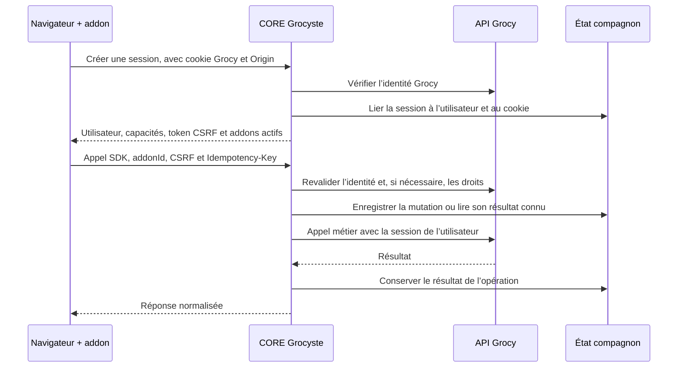

# Architecture et contrats

## Responsabilités

| Composant | Responsabilité | État ou accès |
| --- | --- | --- |
| Chargeur `web/core.js` | Démarrer le SDK, charger les addons actifs dans l’ordre de leurs dépendances et afficher le panneau de réglages. | Page Grocy, session navigateur ; fichier produit par `web/build.mjs`. |
| SDK `web/sdk.mjs` | Transport commun, session Grocyste, CSRF, clé d’idempotence, état révisionné et adaptateurs legacy. | Appels de même origine vers le CORE. |
| CORE `grocyste/runtime.py` | Vérifier l’utilisateur et ses droits, relayer l’API Grocy, fournir les opérations runtime et servir les assets autorisés. | État compagnon ; paquets en lecture seule ; clé de service conservée côté serveur. |
| Gestionnaire `grocyste/manager.py` | Vérifier et installer les paquets, résoudre les dépendances et changer atomiquement la génération active. | Paquets et registre en écriture ; socket Unix privé ; aucun identifiant Grocy. |
| État `grocyste/state.py` | Sessions, documents, révisions, opérations, événements, limites de débit et coffre de fournisseurs. | SQLite `grocyste.sqlite3`, distinct de `grocy.db`. |
| Migration `grocyste/migration.py` | Préparer, activer ou retirer le chargeur à partir d’un reçu. | Personnalisations ; sauvegarde et empreintes de Grocy en lecture seule. |
| Bootstrap `grocyste/bootstrap.py` | Configurer une clé de service vérifiée et les métadonnées techniques nécessaires. | API native et parcours de gestion de clés Grocy ; fichier privé de secret. |
| Runtime live SharedTimers | Synchroniser les sessions et minuteurs compatibles. | Runtime issu d’un paquet SharedTimers vérifié ; contrats live et Grocy natifs. |



## Authentification et frontières de confiance

Le chemin par défaut est `/__grocyste`. La configuration publique expose les versions et métadonnées utiles, sans secret ni chemin de paquet interne. Une session Grocyste est liée au compte et au cookie Grocy ; l’identité est vérifiée auprès de Grocy. Les mutations exigent l’origine publique exacte, un jeton CSRF et une clé d’idempotence valide. Les actions d’administration demandent les permissions Grocy côté serveur.

Les appels métier d’un addon conservent les droits du compte connecté. La clé technique de service n’est pas une clé générale accordée aux addons. La clé privée de signature n’est détenue ni par le CORE ni par le gestionnaire ; ce dernier possède uniquement la clé publique de confiance.

**Les addons restent dans le même contexte JavaScript que Grocy.** Le SDK et les adaptateurs organisent les accès ; ils ne rendent pas les scripts mutuellement isolés. Un script approuvé peut voir le DOM et utiliser les ressources accessibles au navigateur. Les capacités déclarées dans un manifeste constituent une vérification serveur des opérations demandées, pas une preuve d’isolement du code d’un addon.

## API et SDK

Les routes versionnées se trouvent sous `/__grocyste/v1` par défaut.

| Route ou opération | Contrat |
| --- | --- |
| `GET /public-config` | Version du CORE, version d’API, base du chemin et addons connus ; aucun secret. |
| `POST /auth/session`, `POST /auth/logout` | Création et révocation de session liée à Grocy. |
| `POST /grocy/request` | `addonId`, méthode et chemin relatif `api/...` ; capacités `grocy.read` ou `grocy.write` et droits utilisateur. Les entités de clés et sessions Grocy sont privées. |
| `GET/PUT /storage/<addonId>/<name>` | Document d’addon révisionné. L’écriture compare la révision avec `If-Match`. |
| `GET/PUT /settings` | Réglages personnels rattachés au compte Grocy ; aucun secret dans ces documents. |
| `POST /runtime/call` | Opération explicite avec `addonId` et paramètres ; capacité et droits contrôlés. |
| `GET /events`, `GET /jobs` | Événements et suivi disponibles au compte autorisé. |
| `/assets/core.js`, `/assets/<addonId>/<fichier>` | Chargeur ou fichier déclaré d’un addon actif ; chemin contrôlé. |

```js
const addon = window.Grocyste.scope('budgets');
const products = await addon.request('GET', 'objects/products');
const settings = await addon.getStorage('settings');
await addon.putStorage('settings', { ...settings.data, affichage: 'detail' });
```

Le SDK fournit aussi `runtime`, `register`, `assetUrl` et les adaptateurs `compatFetch`, `compatApi`, `compatWindow` et `compatStorage`. Les modules d’addons peuvent partager des moteurs explicitement déclarés. La facade legacy traduit les anciens contrats utilisés par le lot ; elle ne rétablit pas un jeton privilégié NerdCore.

Les familles runtime comprennent `core.pair`, `external.fetch`, `barcode.search`, `receipt-memory.*`, `courseu.state.*`, `sessions.live`, `credential.store`, `credentials.status` et `addons.*`. L’appairage `core.pair` est réservé à l’administrateur connecté et configure le service depuis cette identité validée. Les opérations inconnues sont refusées. Les clés de fournisseurs se configurent côté serveur avec un compte administrateur ; les documents ordinaires ne doivent pas contenir de secret.

Les sorties réseau externes passent par des hôtes autorisés, en HTTPS public, avec limites de taille et de délai. Les transports ne reprennent pas automatiquement les proxies ou identifiants ambiants. L’accès interne à Grocy et au service live repose sur des URL explicitement configurées.

## Paquets et générations

Un manifeste source donne l’identité, la version, la compatibilité Grocy/CORE, les dépendances, les capacités et les points d’entrée. Le script de paquetage construit la liste finale de fichiers, tailles et SHA-256, puis signe le manifeste. Les archives de paquets contiennent uniquement les fichiers déclarés, `manifest.json` et `manifest.sig` ; le gestionnaire refuse les chemins traversants, doublons, liens, fichiers spéciaux et décompressions excessives.

Le gestionnaire prépare les fichiers dans une zone intermédiaire, vérifie les dépendances et publie une seule nouvelle génération de `current.json`. Il conserve le registre précédent dans `history`. Une réinstallation identique devient un `noop`. Une modification ne doit pas rendre incompatible un addon déjà actif. La désactivation d’une dépendance utilisée est refusée ; le retour à une version antérieure repasse par les contrôles de signature, de fichiers et de dépendances.

Le runtime d’un addon peut être exécuté par un service dédié après validation de son paquet. Le gestionnaire n’exécute aucun script d’installation fourni par le paquet et n’a pas de socket Docker ni d’accès de mutation à Grocy.

## Migration et reprise

La préparation reconnaît les assemblages legacy attendus et sauvegarde les fichiers nécessaires, une copie SQLite cohérente et les empreintes des tables métier suivies. Elle conserve les octets de personnalisation étrangers au lot. Une composition legacy modifiée, une inclusion de budget ambiguë ou une dérive de fichiers bloque l’opération avant activation.

Le verrou d’installation couvre le parcours complet. Les quatre anciens services reconnus qui peuvent réécrire le chargeur sont retirés sous sauvegarde privée avant le snapshot final. La fermeture de leur route d’administration et l’absence de vérificateur actif de l’ancien secret sont des constats distincts d’une rotation cryptographique. Le retour ne recrée pas ces services.

La reprise live préserve l’état brut avant et après arrêt de l’ancien propriétaire reconnu, puis reprend sessions et commandes dans l’état compagnon. Seuls les anciens minuteurs locaux annulés sont archivés automatiquement ; les autres états bloquent pour rapprochement. Aucun minuteur natif Grocy n’est créé ou réécrit par cette migration. Le service SharedTimers reste le propriétaire de l’état live actif, tandis que Grocy conserve ses minuteurs natifs.

L’activation compare le chargeur actuel, le reçu et les empreintes métier. Elle écrit le nouveau chargeur atomiquement. Si une modification concurrente rend l’état incertain, le reçu signale la réconciliation nécessaire. Cette protection porte sur les tables explicitement suivies par le code, et ne remplace pas une sauvegarde générale de l’instance.

Le retour du **chargeur** diffère du retour d’un **paquet** : il retire le chargeur Grocyste et conserve Grocy natif avec les personnalisations étrangères. Il ne réactive pas NerdCore. Un reçu n’est pas une autorisation de restaurer toute la base métier par-dessus des changements récents.

Une mutation réseau dont la réponse s’est perdue reste incertaine. Le journal d’idempotence empêche une nouvelle application automatique ; il faut examiner l’effet réel et réconcilier avant de poursuivre. Des révisions de documents ou générations de paquets modifiées entraînent également un conflit explicite.
